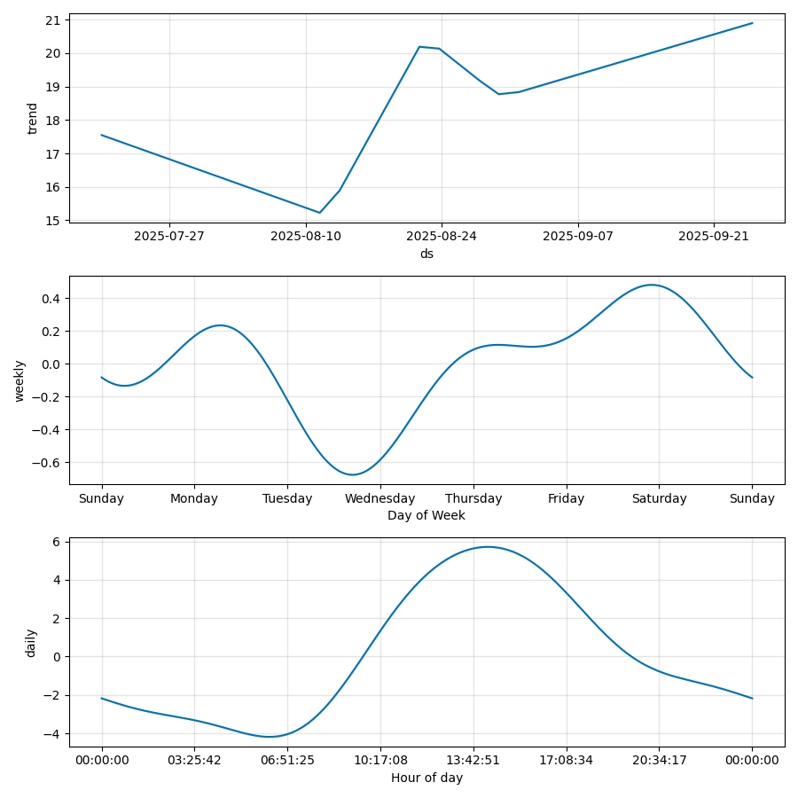

# 📊 Monitoramento Climático Inteligente — Projeto End-to-End

## 📌 Descrição
Pipeline **end-to-end** para coleta, processamento, predição e visualização de dados climáticos. Coleta via Open-Meteo, persistência em **PostgreSQL**, processamento com **PySpark**, modelo **Prophet** e dashboard **Streamlit**.

## 🎯 Objetivos da Análise
- **Coleta de dados** via API Open-Meteo
- **Armazenamento** em PostgreSQL
- **Processamento** e agregação de dados históricos com PySpark
- **Modelagem** usando Prophet para previsão de temperatura
- **Dashboard interativo** em Streamlit para explorar histórico e previsões

## ❓ Perguntas de Negócio
- Qual a previsão de temperatura para as próximas 24 horas na localização X (ex.: São Paulo)?
- Quais padrões diários/semanais são observáveis (sazonalidade, picos)?
- Quais são as estatísticas agregadas relevantes (média horária, máximas diárias, extremos)?
- Qual a acurácia das previsões (RMSE, MAE) para horizontes curtos (24h)?
- Como automatizar a coleta e garantir dados contínuos (pipeline confiável)?
- Qual o impacto de eventos extremos (picos de temperatura) para operações (logística/energia)?


## 🗂️ Estrutura do Projeto

```
projeto-monitoramento-climatico-inteligente/
├── data/
│   └── processed/media_diaria          # Dados gerados pelo Pyspark
│   └── processed/media_horaria         # Dados gerados pelo Pyspark
├── notebooks/  
│   └── analise_modelo.ipynb            # Visualização de Resultados do Modelo
├── src/    
│   ├── coleta_dados.py                 # Coleta e Gravação no Postgres
│   ├── processamento_pyspark.py        # Agregações com PySpark
│   ├── trainamento_modelo.py           # Treinamento Prophet e Salvamento Modelo
│   └── app.py                          # Streamlit Dashboard
├── models/ 
│   └── previsao_diaria.pkl             # Modelo para Previsão Diária
│   └── previsao_horaria.pkl            # Modelo para Previsão Horária
├── assets                              # Gráficos Gerados
├── .gitignore                          # Excessão git
├── requirements.txt                    # Dependências do projeto 
└── README.md                           # Documentação do projeto
```

## 🔧 Ferramentas Utilizadas
- **Python 3.14+**
- **Pandas / Numpy / Unidecode** – Manipulação de dados
- **Pyspark** - Processamento de Dados
- **Requests / SQLAlchemy** - Coleta e ETL
- **Scikit-learn / Prophet** – Modelagem preditiva
- **Joblib** – Salvamento do modelo
- **Matplotlib / Seaborn / Plotly / Streamlit** – Visualização de dados
- **dotenv** - Gerenciamento de Credenciais
- **Jupyter Notebook** – Documentação da análise
---

## 📊 Principais Insights


### Qual é a previsão de temperatura para as próximas 24 horas?

- O dashboard apresenta uma previsão horária detalhada para as próximas **24h**, gerada pelo modelo Prophet, incluindo **intervalo de confiança** (yhat_lower, yhat_upper), permitindo análise de cenários otimista, central e pessimista.


---

### Quais padrões diários são observados?
- A decomposição da série temporal e as agregações PySpark evidenciaram uma forte **sazonalidade diária**, com temperatura mínima tipicamente entre **4h e 6h** e máxima entre **13h e 15h**, padrão consistente ao longo do histórico.

 

---

### Quais são as médias e extremos de temperatura?
- As métricas (média, mínimo, máximo) são calculadas automaticamente em nível horário e diário, permitindo análise de variabilidade climática e acompanhamento de extremos históricos via dashboard interativo.

---

### Como garantir que os dados fiquem atualizados?
- O pipeline de coleta (coleta_dados.py) foi projetado para execução periódica via cron ou orquestradores como Airflow, garantindo ingestão contínua, deduplicação de registros (chave primária por timestamp) e atualização incremental da base de dados.

---

### Quão preciso é o modelo?
- A avaliação com backtesting (janela de validação temporal) resultou em RMSE médio < 1.5 °C para horizontes de 24h, com boa aderência aos padrões sazonais. O modelo é facilmente re-treinado conforme novos dados são incorporados, mitigando model drift.

---

## Próximos Passos
- **Agendar** coleta automática (cron ou Airflow).
- **Implementar** monitoramento de performance do modelo (MAE/RMSE em tempo real).
- **Expandir** para múltiplas localizações (multi-cidades).
- **Incluir** variáveis adicionais (precipitação, vento, umidade) e prever eventos extremos.
- **Integrar** notificações (Slack/Email) para alertar sobre picos de temperatura.

## 📌 Como Reproduzir
```bash
git clone https://github.com/GabrielButti/Projeto-Monitoramento-Climatico-Inteligente.git
cd Projeto-Monitoramento-Climatico-Inteligente
python -m venv venv
venv\Scripts\activate  # (Windows)
pip install -r requirements.txt

Crie um arquivo .env com:

PG_USER=postgres
PG_PASS=postgres
PG_HOST=localhost
PG_PORT=5432
PG_DB=climate_db

python src/coleta_dados.py
spark-submit --jars /path/to/postgresql-42.5.0.jar src/processamento_pyspark.py
python src/trainamento_modelo.py
jupyter notebook notebooks/analise_modelo.ipynb
streamlit run src/app.py
